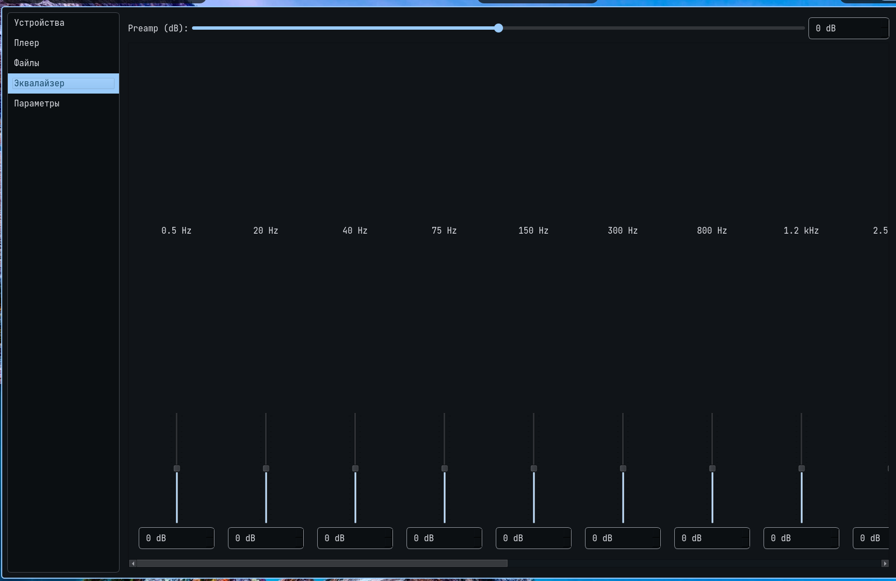
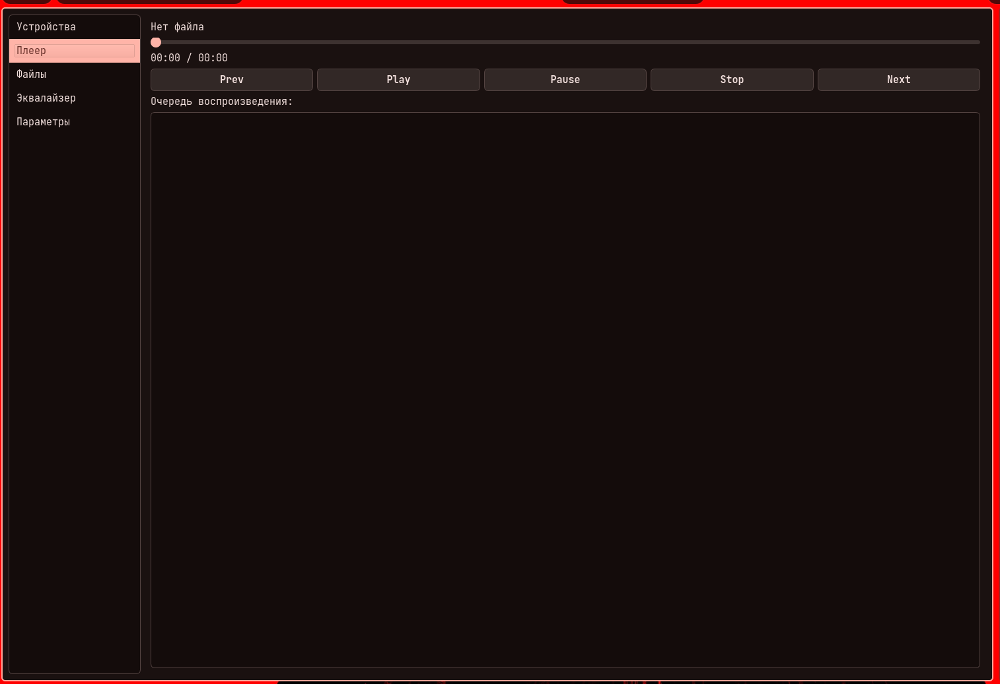
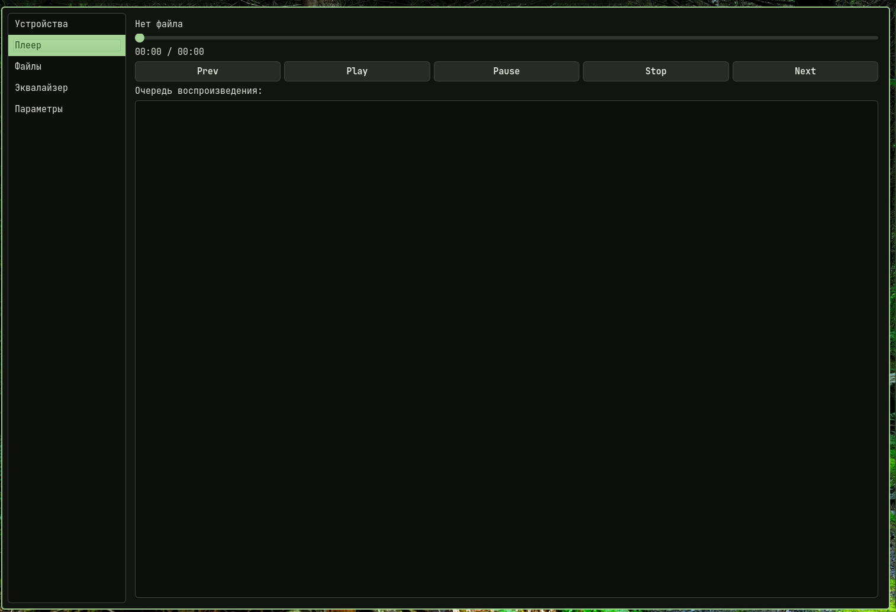

# ZMP
[](https://opensource.org/licenses/MIT)
[](https://www.linux.org/)
[](https://archlinux.org/)
[](https://www.debian.org/)
[](https://getfedora.org/)


Z Media Player by proximacentav

# Features:.
Plaing media.

just starting without errors.

using QT6.

consume about 127M ram.

## colored themes:

### blue:


### red:


### green:


# Installing:
download depencieses: 

debian: sudo apt install qt6-base-dev qt6-multimedia-dev cmake build-essential git

fedora: sudo dnf install qt6-qtbase-devel qt6-qtmultimedia-devel cmake gcc-c++ git

arch: sudo pacman -S qt6-base qt6-multimedia cmake base-devel git
also install bass audio library (libbass, libbas_fx)

```bash
git clone https://github.com/proximacentav/ZMP.git
cd ZMP/build
cmake ..
make
```
or just download binary file in releases page
# VERSION: BETA v 0.2.5(позвоночник позвонил)
