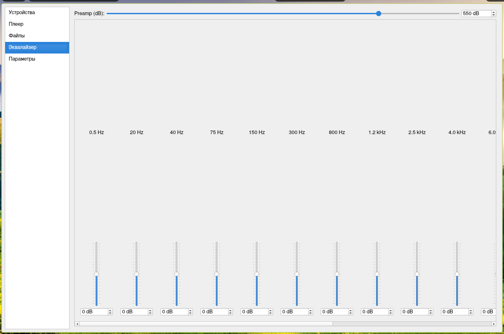
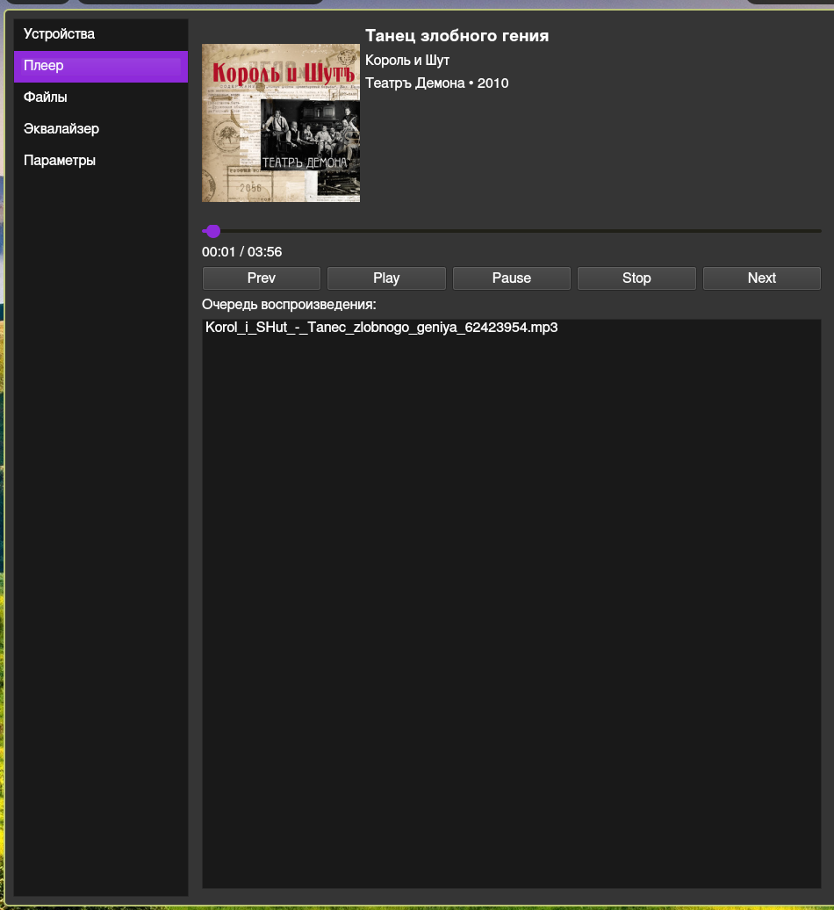
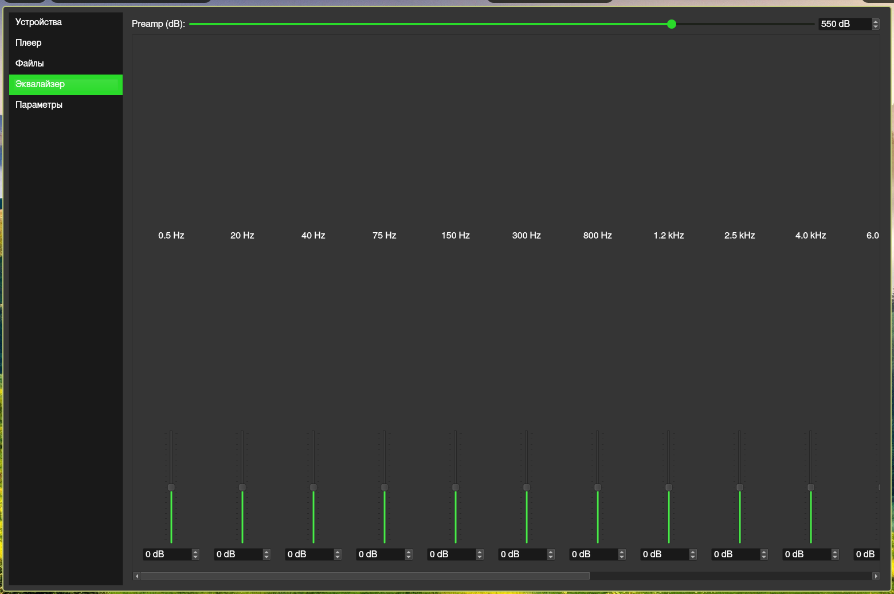

# ZMP version BETA 0.7.0
[](https://opensource.org/licenses/MIT)
[](https://www.linux.org/)
[](https://archlinux.org/)
[](https://www.debian.org/)
[](https://getfedora.org/)


Z Media Player by proximacentav

# Features:.
Plaing media.

just starting without errors.

using QT6.

equalizer (+1000db, -1000db preamp max)

metadata view

consume about 127M ram.

black/white theme

playlists system

Speed of tracks

updated design

tones of tracks

spectrogramm

## colored themes:
## screenshots of 0.4.0 version
### blue white:

### black purple:

### black_green:


# Playlists
Zmp creating directory ~/zmp_playlists

when you creating playlist with name "root"

zmp creating directory ~/zmp_playlists/root

.mp3 and other music files put to ~/zmp_playlists/nameofplaylist

now you can delete source files of your songs, audio files in playlist

# Installing:
download depencieses: 

debian: sudo apt install qt6-base-dev qt6-multimedia-dev cmake build-essential git libtag1-dev

fedora: sudo dnf install qt6-qtbase-devel qt6-qtmultimedia-devel cmake gcc-c++ git taglib-devel

arch: sudo pacman -S qt6-base qt6-multimedia cmake base-devel git qtmpris taglib


```bash
git clone https://github.com/proximacentav/ZMP.git
cd ZMP/build
cmake ..
make
```
## or just download binary file in releases page (recomended)
# VERSION: BETA v 0.7.0(???)
