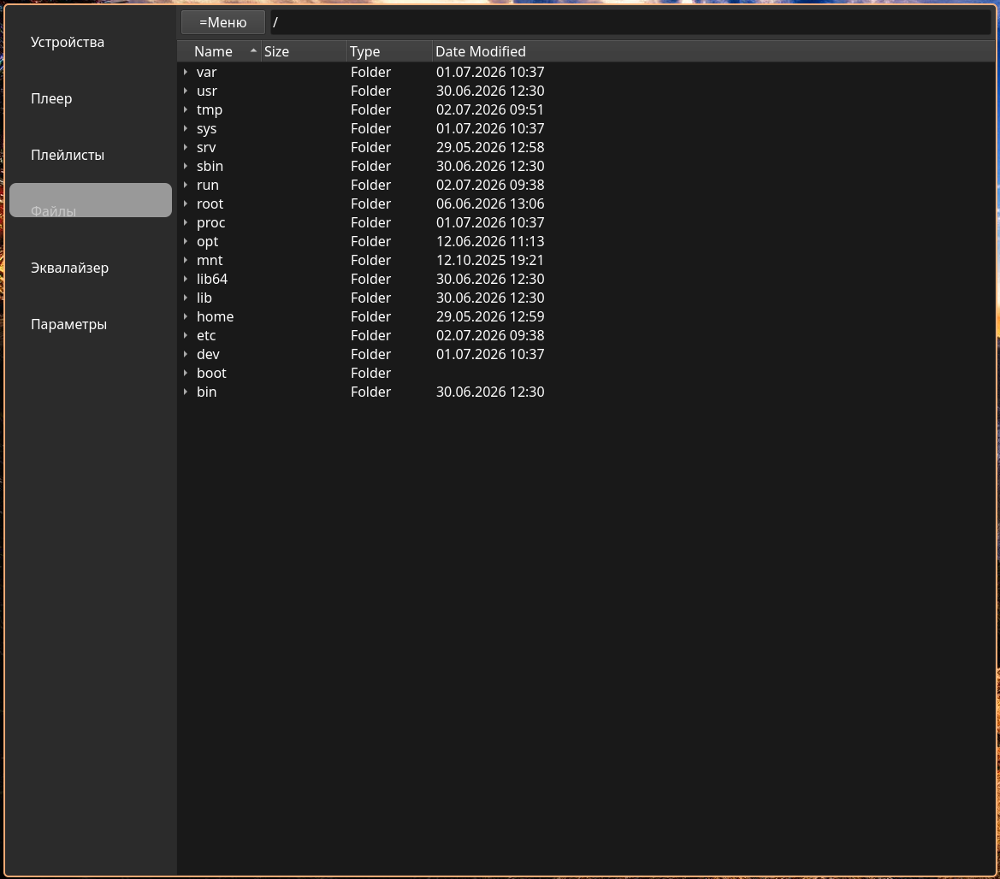
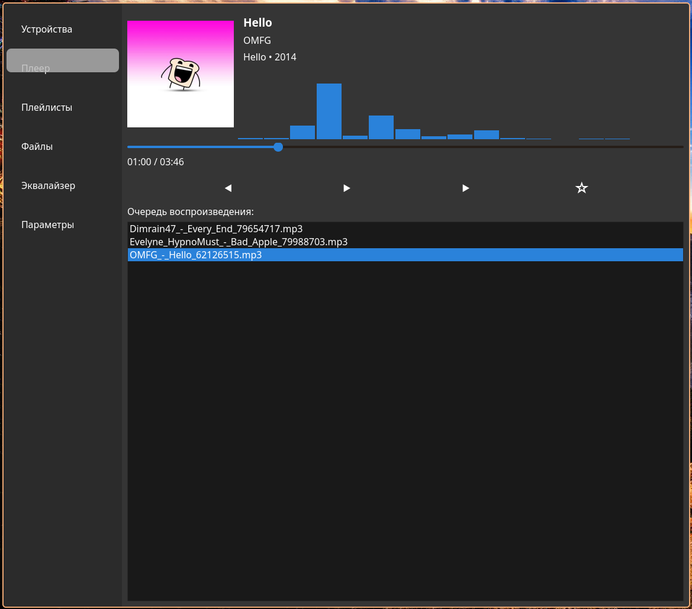
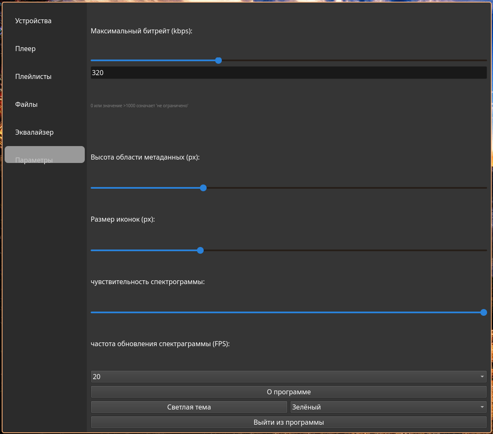
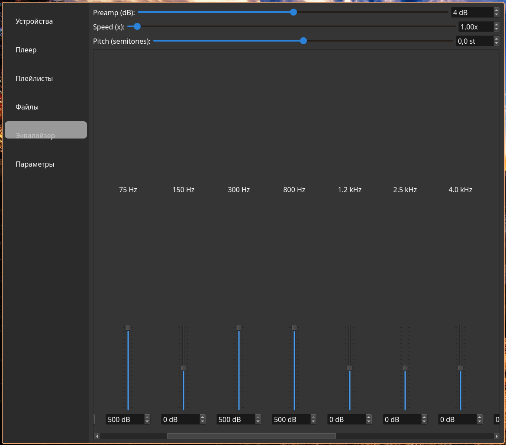
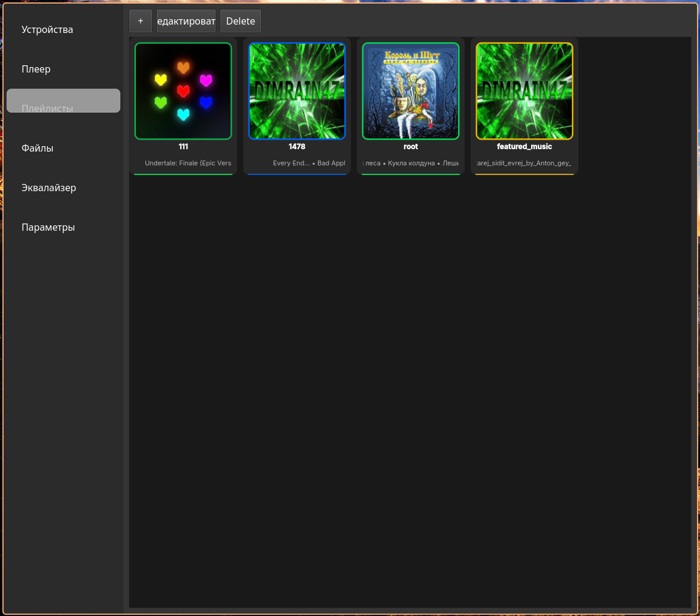

# Z MEDIA PLAYER BY PROXIMACENTAV beta v 0.9.1 (ЗАвтра)

**ZMP** - Медиаплеер для LINUX с встроенным файловым менеджером, плейлистами, хорошим? дизайном, предусилением, эквалайзером, сменой тонов в st(semitones) и скорости
поддержкой очереди воспроизведения и другими функциями

## features:

- **воспроизведение звука** - главная функция просто может воспроизводить файлы музыки
- **пауза, next, prev, featured** - кнопки управления воспроизведением
- **QT** - сделан на qt и имеет граффический интерфейс
- **метаданные** - во время воспроизведения показывает метаданные файла который воспроизводится
- **Избранные треки** - поддержка избранной музыки (встроенный плейлист)
- **Система плейлистов** - имеет плейлисты это заготовленные очереди воспроизведения 
- **плейлисты подробнее** - файлы которые вставлены в плейлисты после его создания копируются в ~/zmp_playlists/название_вашего_плейлиста
- **эквалайзер** - поддерживает много частот для их предуселения до +500db и основное предусиление от -1000 до +1000db 
- **скорость и тоны** - поддерживает смены тональности, смену скорости воспроизведения
- **акцентный цвет** - позволяет менят цвет акцента(дополнительный цвет) которым будут выделятся некоторые элементы
- **темы** - поддерживает светлую и темную темы в связке с акцентными цветами
- **файловый мененджер** - имеет встроенный файловый проводник который подсвечивает зеленым файлы музыки и позволяет заходить в любые директории
- **поиск по файлам** - можно искать файлы по названию в файловой системе
- **устройства воспроизведение** - базовая функция любого медиаплеере тут тоже есть "смена устройства для воспроизведения музыки"
- **спектрограмма** - поддерживает визуализацию звука простой спектрограммой FPS которой можно менять от 5 до 1000000
- **настройки** - имеет пока что небольшую вкладку настроек

## использование:
1. запустить
```bash 
./ZMP_linux_bin 
```
2. зайти во вкладку файлы, найти ваш трек в файловой системе и дважды нажать
3. хз что еще можно создать плейлист

## установка(* - необязательно)
1. зайти в releases и скачать последнюю версию потом запустить
2*. скопировать в /bin/ чтобы можно было вызвать из терминала
```bash
mv ZMP_linux_bin /bin/zmp
chmod +x /bin/zmp
```

## установка (с компиляцией)
```bash
git clone https://github.com/proximacentav/ZMP.git
cd build ZMP/build
rm -f *
```
2*. компилируйте как хотите но стандартный метод это cmake и make:
``` bash
cd ~/ZMP/build
cmake ..
make 
```
3*. опционально можно написать make -j(nproc) это может ускорить компиляцию т.к использует все ядра ЦП

## основные библеотеки (и не только) которые были использованы:
- **C++**
- **QT**
- TagLib
- **LibBass**
- LibBass_fx
- CMAKE
- Make
- git
- github.com

## скриншоты:







